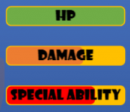

# Phaser 3 UI by Blobattack.com

This is a UI library for Phaser 3. Since there was nothing really out there that is simillar, we made this so that if other people are looking for the same thing, for example an easy way to make a working button. We have that, and as we add more controls for creating [BlobAttack](https://blobattack.com) we will upload more.

Currently we have two controls:
## Button
[Button](button.md)

## Progress Bar
[Progress Bar](progressbar.md)

GO CHECK IT OUT NOW!!! At [BlobAttack](https://blobattack.com)
